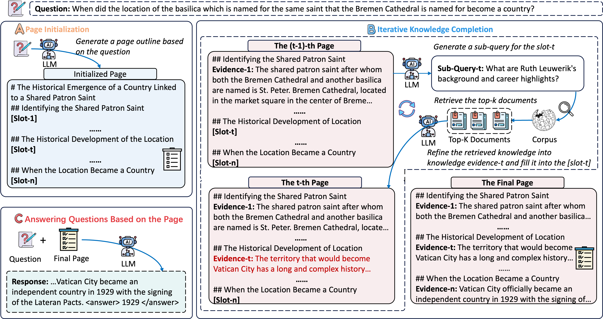

<div align="center">
<h1> Structured Knowledge Representation through Contextual Pages for Retrieval-Augmented Generation
<h5 align="center"> 
  
<a href='https://arxiv.org/abs/2601.09402'></a>
<a href='https://huggingface.co/Qwen/Qwen3-32B'>
<a href='https://huggingface.co/meta-llama/Llama-3.1-70B-Instruct'>
<a href='https://huggingface.co/Qwen/Qwen3-Embedding-0.6B'>

Xinze Li<sup>1</sup>,
Zhenghao Liu<sup>1</sup>,
Haidong Xin<sup>1</sup>,
Yukun Yan<sup>2</sup>,
Shuo Wang<sup>2</sup>,
Zheni Zeng<sup>3</sup>,
Sen Mei<sup>2</sup>,
Ge Yu<sup>1</sup>,
Maosong Sun<sup>2</sup>

<sup>1</sup>Northeastern University, <sup>2</sup>Tsinghua University, <sup>3</sup>Nanjing University

</h5>
</div>


## 📖 Introduction

**PAGER** is a page-driven autonomous knowledge representation framework designed for organizing and utilizing knowledge in Retrieval-Augmented Generation (RAG) scenarios. Specifically, **PAGER** first prompts an LLM to construct a structured cognitive outline for a given query, consisting of multiple slots, each representing a distinct knowledge dimension. Guided by these slots, **PAGER** then iteratively retrieves and refines relevant documents, populating each slot with pertinent information, and ultimately constructs a coherent "knowledge page" that serves as contextual input for answer generation. Experimental results on multiple knowledge-intensive benchmark tasks and across various backbone models show that **PAGER** consistently outperforms all RAG baselines across evaluation metrics.

<p align="center"></p>


## ⚙️ Setup

```bash
conda create --name PAGER python==3.11
conda activate PAGER
git clone https://github.com/OpenBMB/PAGER.git
cd PAGER
pip install -r requirement.txt
```

## 🔧 Reproduction Guide

This section provides a step-by-step guide to reproduce our results.

### 1. Evaluation Dataset Download
You can download the evaluation dataset required for this experiment from [here](https://drive.google.com/drive/folders/1-ByTyrchohtmZqoZVawmp6A9TA9bRnh_?usp=drive_link). We use the Wiki dataset provided by FlashRAG as the retrieval corpus, and the downloading and processing procedures are detailed [here](https://github.com/RUC-NLPIR/FlashRAG/blob/main/docs/original_docs/process-wiki.md).

For the downloaded evaluation dataset and the processed corpus, you need to move them to the `evaluation_dataset` folder.

### 2. Deploying a Retrieval Model Service


#### 2.1. Encode the Wikipedia Corpus:
For the downloaded corpus, you need to encode it using the Qwen3-0.6 embedding model and store the resulting embeddings `wiki.npy` in the `embedding` directory. You need to run the following script.

```bash
bash bash/embed.sh
```

#### 2.2. Build an Index for the Encoded Embeddings:
For the encoded Wikipedia embeddings, `wiki.npy`, you need to build a FAISS index for it to be used in subsequent retrieval. The constructed index should be saved as `wiki.index` in the `embedding` directory. You need to run the following script.
```bash
bash bash/index.sh
```

#### 2.3. Build an Index for the Encoded Embeddings:
Next, you need to run the `vllm_emb.sh` script to deploy the `Qwen3-Embedding-0.6B` model to the GPU and run it in the background.
```bash
bash bash/vllm_emb.sh
```
#### 2.4. Deploy the Retrieval Service:
Afterward, you need to run the `ret_serve.sh` script to deploy the retrieval service in the background.
```bash
bash bash/ret_serve.sh
```

### 3. Construct the Structured Page
#### 3.1. Construct the Outline:
Construct an outline for the questions in the evaluation dataset. You need to run the following script and store the generated outline in the `output_data/outline` directory.

```bash
bash bash/construct_outline.sh
```
Afterward, extract the structured outline from the outline to serve as the initialized page and store it in the `output_data/outline` directory.
```bash
bash bash/extract_outline.sh
```
#### 3.2. Construct the Page:
After obtaining the initialized page, you need to iteratively fill it with knowledge until the final knowledge representations are produced, and store the results in the `output_data/page` directory.
```bash
bash bash/construct_page.sh
```

### 4. Page Inference
#### 4.1. Infer the Answers.
After obtaining the pages generated in the `output_data/page` directory, you need to use the generated pages to answer the given questions and store the resulting answers in the `output_data/infer` directory.

```bash
bash bash/infer_page.sh
```
#### 4.2. Evaluate the Accuracy of the Answers.
Finally, you can run the following script to evaluate the accuracy of the answers.
```bash
bash bash/evaluate_infer.sh
```
## 📁 Repository Structure
```
PAGER/
├── README.md
├── requirements.txt
├── output_data/               # Sample outputs generated by the PAGER
├── figs/                      # README figures
├── bash/                      # The script files used to run the experiments
└── src/
    ├── retriever/             # Deploy the retrieval service
    ├── construct_outline.py   # Construct the outline
    ├── construct_page.py      # Construct the page
    ├── extract_outline.py     # Initialize the page
    ├── infer_page.py          # Inference the questions
    └── evaluate_infer.py      # Evaluate the performance of the answers
```

## 📄 Acknowledgement 
Our work is built on the following codebases, and we are deeply grateful for their contributions.
- [FlashRAG](https://github.com/RUC-NLPIR/FlashRAG)
- [UltraRAG](https://github.com/OpenBMB/UltraRAG)

## 🥰 Citation
We appreciate your citations if you find our paper related and useful to your research!
```
@article{li2026structuredknowledgerepresentationcontextual,
  title={Structured Knowledge Representation through Contextual Pages for Retrieval-Augmented Generation}, 
  author={Xinze Li and Zhenghao Liu and Haidong Xin and Yukun Yan and Shuo Wang and Zheni Zeng and Sen Mei and Ge Yu and Maosong Sun},
  year={2026},
  url={https://arxiv.org/abs/2601.09402}, 
}
```


## 📧 Contact
If you have questions, suggestions, and bug reports, please email:
```
lxzlxz0716@gmail.com
```
