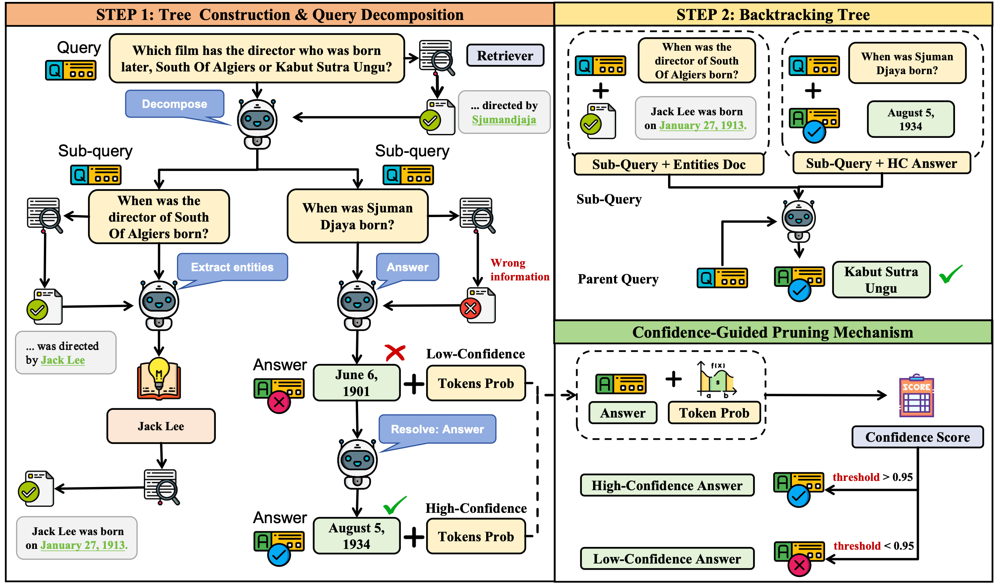
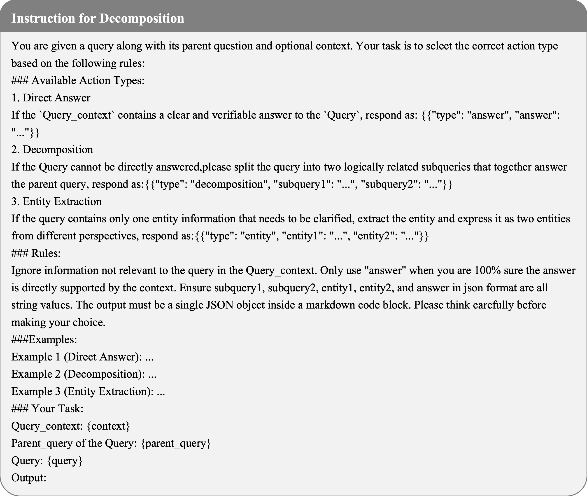
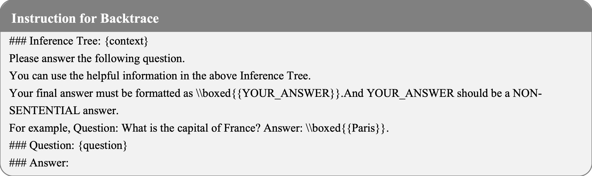
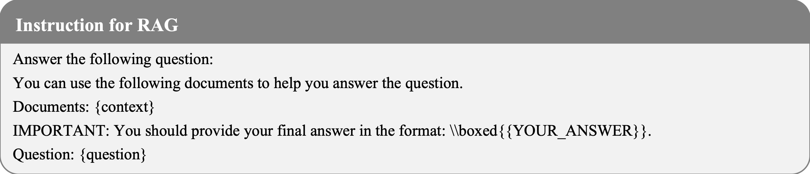

# PruneRAG: Confidence-Guided Query Decomposition Trees for Efficient Retrieval-Augmented Generation

## Project Overview



Retrieval-augmented generation (RAG) has become a powerful framework for enhancing large language models in knowledgeintensive and reasoning tasks. However, as reasoning chains deepen or search trees expand, RAG systems often face two persistent failures: evidence forgetting, where retrieved knowledge is not effectively used, and inefficiency, caused by uncontrolled query expansions and redundant retrieval. These issues reveal a critical gap between retrieval and evidence utilization in current RAG architectures. We propose PruneRAG, a confidence-guided query decomposition framework that builds a structured query decomposition tree to perform stable and efficient reasoning. PruneRAG introduces three key mechanisms: adaptive node expansion that regulates tree width and depth, confidence-guided decisions that accept reliable answers and prune uncertain branches, and fine-grained retrieval that extracts entity-level anchors to improve retrieval precision. Together, these components preserve salient evidence throughout multi-hop reasoning while significantly reducing retrieval overhead. To better analyze evidence misuse, we define the Evidence Forgetting Rate as a metric to quantify cases where golden evidence is retrieved but not correctly used. Extensive experiments across various multi-hop QA benchmarks show that PruneRAG achieves superior accuracy and efficiency over state-of-the-art baselines.


## Project Structure

The project is organized into the following main components:

- **pipelines/**: Contains various pipeline implementations for different reasoning strategies
  - `tree_pipeline.py`: Core implementation of the tree-structured RAG approach
  - Other baseline pipelines (cot_pipeline.py, rag_pipeline.py, etc.) for comparison
- **scripts/**: Contains utility modules for data loading, evaluation, search, and more
- **config/**: Configuration files for dataset paths and other settings
- **figures/**: Visual materials including prompt examples and research figures
- **run_*.sh**: Shell scripts for running different experiments

## Supported Datasets

Tree-RAG supports the following datasets out of the box:
- gpqa, nq, triviaqa, hotpotqa, 2wiki, musique, bamboogle

## Getting Started

To run the PruneRAG system, follow these steps:

1. First, start the retrieval service:
```bash
# Launch the retrieval server
./launch_retriever.sh
```

2. Then, evaluate baseline models for comparison:
```bash
# Run baseline models
./run_baselines.sh
```

3. Finally, run the PruneRAG system:
```bash
# Run the PruneRAG system
./run_prunerag.sh
```

## Prompts Examples

Below are the prompt examples used in the Tree-RAG framework (located in the figures directory):


### Instruction for Decomposition


### Instruction for Backtrace


### Instruction for Vanilla


### Instruction for RAG



## Citation
If you find this code useful for your research, please cite our paper:
```
@article{jiao2026prunerag,
  title={PruneRAG: Confidence-Guided Query Decomposition Trees for Efficient Retrieval-Augmented Generation},
  author={Shuguang Jiao, Xinyu Xiao, Yunfan Wei, Shuhan Qi, Chengkai Huang, Quan Z. Michael Sheng and Lina Yao},
  conference={The Web Conference 2026 (WWW)},
  year={2026}
}
```
## License


## Acknowledgements

This project was developed to advance the state-of-the-art in retrieval-augmented generation for complex question answering tasks.
